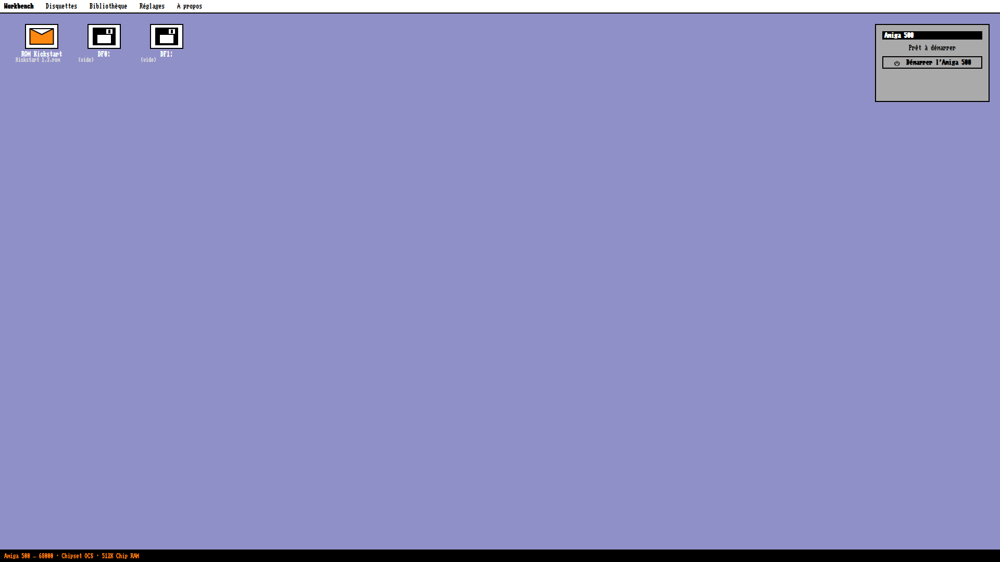

# A500 Launcher

A Windows 11 front end, styled after **Workbench 1.3**, dedicated **exclusively** to
emulating an **Amiga 500**. No other model is ever shown (no A600, A1200, CD32): the
CPU (68000), the chipset (OCS) and the memory (512K chip, optional +512K trapdoor) are
fixed in the application.

Under the hood it drives **WinUAE**, but its technical interface is never shown: only
the Amiga 500 "desktop" with its icons.

## Requirements

- **Windows 11** (build 22000 or later). The application refuses to run on older systems.
- A **Kickstart ROM** (1.2 or 1.3) and your own **`.adf`** disk images.

**WinUAE 6.0.3 (64-bit) is bundled** — nothing else to install.

## Install

Run `A500Launcher-Setup-<version>.exe`, or unpack
`A500Launcher-<version>-portable.zip` anywhere and run `A500Launcher.exe`.
The installer keeps your settings, library, `bios` and `roms` folders on uninstall.

The download is not code-signed, so Windows SmartScreen may warn on first run.
Verify the file against `SHA256SUMS` from the same release, then choose
*More info → Run anyway*.

## Portable folders

Three folders next to the executable are used automatically:

| Folder    | Contents                                  |
|-----------|-------------------------------------------|
| `winuae/` | `winuae64.exe` (bundled)                   |
| `bios/`   | your Kickstart ROM (`.rom` / `.bin`)       |
| `roms/`   | your disk images (`.adf`)                  |

On startup the application fills any empty setting from these folders. A path you set
yourself is never overwritten.

## Usage

1. Put your Kickstart ROM in `bios/` (or set it from the **Kickstart ROM** desktop icon).
2. Put your `.adf` files in `roms/`, then click the **DF0:** icon (and **DF1:** if needed).
3. Click **Start the Amiga 500**.

The application writes a locked Amiga 500 `.uae` configuration to
`%TEMP%\A500Launcher\a500_session.uae` and launches WinUAE with it.

Press **Esc** to close the launcher.

## Languages

English, French, German, Spanish, Italian, Dutch, Polish, Swedish. The launcher
follows the Windows language on first run; change it in Settings. Translators: see
[docs/i18n.md](docs/i18n.md).

## Licence

Freeware. Source code not distributed. See [LICENSE](LICENSE).

- WinUAE is third-party software under its own licence.
- Kickstart ROMs and disk images are copyrighted. Use only files you own legally
  (a dump of your own Amiga, Cloanto Amiga Forever, etc.).

## Website

https://patrickjaillet.github.io/a500launcher — built from `docs/` and served by
GitHub Pages.

## Contact

- E-mail: sandefjord.development@proton.me
